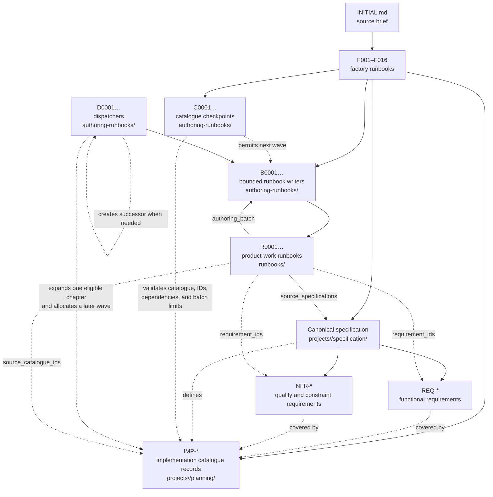

# Runbook Generator

This repository is a generic, Supervisor-driven factory for turning a concise
product brief into a complete, dependency-ordered implementation plan. It is
not tied to a particular app type, framework, agent, or delivery platform.

Given a brief for a game, desktop application, web product, operating system,
developer tool, service, document system, or any other product, the factory
first discovers the product domains and creates a canonical specification. It
then builds a scalable collection of detailed implementation runbooks.

## Install Supervisor

Install the global Supervisor CLI once. It requires Python 3.10 or newer but
does not require administrator access:

```zsh
curl -fsSL https://raw.githubusercontent.com/jakowicz/supervisor/main/scripts/install.sh -o /tmp/supervisor-install.sh
bash /tmp/supervisor-install.sh
```

If the installer says `~/.local/bin` is not on your `PATH`, add the line it
prints to your shell profile, then open a new terminal. Confirm the commands
are available:

```zsh
supervisor --help
supervisor-run --help
```

## Start a factory run

From the repository root, there are only two actions required to start a
factory run.

1. Create a named project workspace and its
   `projects/<project-name>/INITIAL.md` brief with the interactive wizard. It
   asks for the project name, product type, target systems, users,
   requirements, constraints, references, and open decisions. Responsive web
   and PWA support are included by default.

```zsh
supervisor initial --force
```

   `--force` deliberately replaces an existing brief with the same project
   name; omit it if you want the command to refuse to overwrite it.

2. Review the generated `projects/<project-name>/INITIAL.md`, make any edits
   you want, then run that named project:

```zsh
supervisor-run --project <project-name>
```

`--project` reads that project's `INITIAL.md`, runs the reusable F-series, then
automatically follows the generated B-series and R-series files. It keeps the
factory's durable task history in `projects/<project-name>/.state/`, its
versioned project configuration in `projects/<project-name>/.env`, and private
credentials in ignored `projects/<project-name>/.secrets.env`, so a later
`supervisor-run --project <project-name>` resumes at the first unfinished task
and does not rerun accepted tasks. That workspace contains its normalized brief,
specification, complete work checklist, generated B-series runbook-writing
files, R-series product-work runbooks, and handoff documentation.

### When generated R runbooks run and become accepted

You do not run generated R files manually in the normal workflow. Keep using:

```zsh
supervisor-run --project <project-name>
```

After the B-series authoring collection is complete, Supervisor follows its
explicit child-collection registration to `projects/<project-name>/runbooks/`.
It then runs each generated R file in its declared dependency order. For every
R task, Supervisor loads the project `.env`, runs the configured coding and
conditional asset/audio/QA stages, checks the task's acceptance criteria and
evidence, and records the outcome in
`projects/<project-name>/.state/runbooks.sqlite3`.

An R file is **generated** as soon as a B writer creates its Markdown file. It
is **accepted** only after its configured execution pipeline and completion
audit pass. If a task fails validation, lacks required evidence, or needs a
human decision, it is not accepted; the run stops at that task and a later
`supervisor-run --project <project-name>` resumes it safely. The exact stages
are project policy from `.env`, so a Codex-only project and a project with test,
browser, art, and audio lanes can have different acceptance pipelines.

## Factory end-to-end test

Run the opt-in real-agent factory acceptance test through the generator CLI:

```zsh
scripts/runbookgen e2e
```

It prompts you to choose from a few small example projects—two games, a todo
app, text editor, mini OS utility, file-processing API, or internal helpdesk—
then runs that project's factory and verifies a second run resumes accepted
work. For unattended use, set a scenario explicitly:

```zsh
E2E_SCENARIO=todo-app scripts/runbookgen e2e
```

For example, the command above creates `projects/e2e-todo-app/`, then runs the
F-series factory, its generated B-series authoring collection, and the resulting
R-series runbooks. It uses the configured real agents, validates the generated
R-series files, and runs once more to confirm durable resume behaviour. The
workspace remains under `projects/` for inspection.

## See or resume project progress

From the repository root, list every named workspace and its current phase,
accepted/pending counts, next task, and exact resume command:

```zsh
supervisor projects
```

Run `supervisor-run --project <project-name>` at any time to resume that
project. Its SQLite task state makes accepted tasks skip safely and returns to
the first unfinished task.

## What the runbook series mean

These are this factory's names, not an industry-standard vocabulary. The letter
describes *which layer of work a runbook belongs to*, rather than a product
feature or a required technology. In normal use, you only need to care about
`INITIAL.md`, F, B, and R.

### Runbooks you normally use

| Series | Meaning | Created by | Where it lives | What it does |
| --- | --- | --- | --- | --- |
| `INITIAL.md` | Source brief | You or `supervisor initial` | `projects/<project-name>/` | The concise source brief: what is being made, for whom, where it will run, constraints, references, and desired outcome. It gives every later stage its context. |
| `F001`–`F016` | **Factory** | This repository | `runbooks/` | **Factory runbooks.** They analyse the brief, write the detailed product plan, and create the files that will write the final implementation instructions. They do not build the requested product. |
| `B0001`, `B0002`, … | **Bounded authoring batch** | The F-series and later B dispatcher files | `projects/<slug>/authoring-runbooks/` | **Runbook-writing tasks.** A B task writes the next small set of R files. “Bounded” means it has a hard limit: one B task may write no more than seven R files. |
| `R0001`, `R0002`, … | **Real product-work runbook** | B-series runbook-writing tasks | `projects/<slug>/runbooks/` | **Product-work runbooks.** Each R file gives detailed instructions and success checks for one small piece of building, testing, reviewing, documenting, or original-asset work. Every R file explicitly declares asset metadata and provenance links to its canonical specification, catalogue records, B batch, and originating F stages. |

### Internal planning and coordination

These files and records let the factory safely scale to a large application.
They are important to the generator, but not things you normally need to read
or manage while building the product.

| Internal ID | Meaning | Created by | Where it lives | What it does |
| --- | --- | --- | --- | --- |
| `REQ-0001`, `REQ-0002`, … | **Functional requirement** | F011 specification/traceability stage | `projects/<slug>/specification/requirements.md`, `requirements.json`, and `traceability-matrix.md` | A stable statement of behaviour or capability the product must provide. It is a requirement, not a runnable task. |
| `NFR-0001`, `NFR-0002`, … | **Non-functional requirement** | F011 specification/traceability stage | `projects/<slug>/specification/requirements.md`, `requirements.json`, and `traceability-matrix.md` | A stable quality or constraint requirement—such as performance, accessibility, security, reliability, privacy, compatibility, or observability. It is not a runnable task. |
| `IMP-0001`, `IMP-0002`, … | **Implementation catalogue record** | The F-series planning stages and later D dispatchers | `projects/<slug>/planning/implementation-catalogue-index.json` and the authoring manifest/ledger | **Planning and traceability records, not runnable runbooks.** Each record captures a needed piece of work, its requirements, dependencies, ownership, verification, and asset assessment before it is allocated to a B writer. |
| `C0001`, `C0002`, … | **Catalogue checkpoint** | The factory or an authoring dispatcher | `projects/<slug>/authoring-runbooks/` | **Authoring coordination only.** A C task validates the catalogue, manifest, IDs, dependency coverage, and batch limits before another writing wave proceeds. It creates no product code and normally creates no R files. |
| `D0001`, `D0002`, … | **Dispatcher** | The factory or an earlier dispatcher | `projects/<slug>/authoring-runbooks/` | **Authoring coordination only.** A D task expands one eligible planning chapter, allocates the next bounded B batches, and leaves one successor dispatcher if more catalogue work remains. It does not build the product or write R implementation files itself. |

### How the generated runbooks and records connect

Solid arrows show files or records created by a stage. Dotted arrows show
validation, scheduling, or traceability links rather than a task creating its
source material.



In short:

```text
your brief → F-series factory → B-series runbook writers → R-series product work
                                  ↑ C checkpoints and D dispatchers coordinate authoring only
```

The stable planning chain is `REQ/NFR requirement → specification → IMP
catalogue record → B writer → R runbook`. `REQ-0007` is a functional behaviour
requirement; `NFR-0004` is a quality/constraint requirement. Neither is another
name for `IMP-0007` or `R0007`. `IMP-0007` is a planning record, while `R0007`
is an executable piece of product work. Their numbers are intentionally
independent. One IMP record may be split into several R files, combined with
related IMP records into one R file, or held until its dependencies are ready.
An R file records that mapping in `requirement_ids` and `source_catalogue_ids`.

The hierarchy stops there: F creates the plan and the B files, B writes R files,
and R files describe the real implementation or verification work. For example,
a B file for an RPG's combat area might write up to seven R files: basic combat,
damage calculation, enemies, abilities, battle UI, balancing, and tests. For a
large product, more B files are created for the next areas instead of making one
agent write thousands of R files at once. The Supervisor finds those later B
files and the R files automatically, so one `--run-all` invocation continues
until the generated collection reaches its final audit or a real review gate.

`C` and `D` are deliberately less important to the application than F, B, and
R. They are internal factory controls: C checks that the generated task plan is
safe and complete; D schedules the next small writing wave for a very large
plan. They live with B files because they use the same authoring state and
operate before R product work exists. They should be visible in status so a
paused factory can be understood, but they are not application features and do
not become part of the generated app.

### How runbooks reference one another

Runbooks do not pass the whole project history into every later prompt. They
use a small, explicit chain of references, while the full workspace remains
available for targeted lookup.

| When | What is used | Why |
| --- | --- | --- |
| `F001` | `projects/<name>/INITIAL.md` | The user’s original brief is the source of truth. F001 normalizes it but never replaces it. |
| `F002`–`F004` | `INITIAL.md`, `PROJECT_BRIEF.md`, and the relevant earlier specification chapters | These stages refine product/domain, technical, and experience decisions. They use the documents produced by earlier F stages—not every earlier F Markdown procedure. |
| `F005`–`F010` | The canonical `specification/` chapters and earlier planning outputs | These stages translate established decisions into dependencies, delivery areas, authoring contracts, and a safe handoff. |
| `F011`–`F013` | The canonical specification plus the delivery/contract planning outputs | These stages create the traceability system, implementation catalogue, dependency graph, and small B-series batches. |
| `F014`–`F016` | The catalogue, authoring manifest, quality gate, and canonical specification | These stages create B writers, validate their intended R contracts, and register the child collections that Supervisor follows. |
| A B-series writer | Its own F013 context packet: only the assigned catalogue records, relevant specification sections, target constraints, templates, and reserved IDs | It writes no more than seven R files without needing a huge prompt or unrelated product context. |
| A C checkpoint or D dispatcher | The authoring manifest, catalogue, ledger, and only the relevant canonical specification chapter | It validates and schedules the authoring process; it is not product implementation context. |
| An R-series task | Its own objective, dependencies, acceptance criteria, and provenance metadata | It performs one small piece of product work. It can open the linked canonical files when it needs more detail. |

Each generated R file must declare this provenance in its front matter:

```yaml
requirement_ids:
  - REQ-0007
  - NFR-0004
source_specifications: specification/03-technical-contract.md#save-state
source_catalogue_ids: IMP-SAVE-001
authoring_batch: B0007
factory_stages: F003,F005,F012,F013
```

These fields answer different questions:

- `requirement_ids` — which functional (`REQ-*`) and quality/constraint (`NFR-*`) requirements the task fulfils or verifies.
- `source_specifications` — which canonical requirement sections explain the work.
- `source_catalogue_ids` — which planned implementation records the task covers.
- `authoring_batch` — which bounded B writer created this R task.
- `factory_stages` — which F stages established the underlying requirement.

The F and B references provide **provenance**, not a reason to use procedural
factory Markdown as implementation requirements. The canonical specification
and planning files remain the authoritative context. R-to-R dependencies define
execution order; Supervisor also follows explicit `.supervisor-children/`
registrations from the F collection to the B collection and then to the R
collection.

### Terms used in this repository

| Term | Meaning here |
| --- | --- |
| **Runbook** | A Markdown work instruction with scope, steps, dependencies, and evidence required to mark it complete. |
| **Runbook-writing task / authoring task** | A runbook whose output is more runbook Markdown files. It does not write application code. B-series files are these tasks. |
| **Bounded** | Deliberately limited in size. A B-series task writes a maximum of seven R-series files. |
| **Catalogue** | The complete checklist of product work that must eventually be covered: features, technical foundations, content, quality, release work, and dependencies. |
| **Collection** | A folder of runbooks that Supervisor can run. The root F collection creates child B and R collections for one generated project. |
| **Dispatcher** | A B-series file whose only job is to create the next B-series files when more parts of the catalogue still need R runbooks. |
| **Contract** | The required shape of a runbook: its goal, inputs, steps, acceptance criteria, and evidence. It is not a legal agreement or an API contract. |

### F-series factory stages, in detail
| **Functional requirement (`REQ-*`)** | A stable statement of behaviour or capability the product must provide. Stored in the project’s `specification/requirements.md` and `requirements.json`, with coverage shown in `traceability-matrix.md`. |
| **Non-functional requirement (`NFR-*`)** | A stable quality, safety, delivery, or operating constraint—such as performance, accessibility, security, reliability, privacy, or compatibility. Stored and traced alongside functional requirements. |

| **Implementation catalogue record (`IMP-*`)** | One stable planned work record in `planning/implementation-catalogue-index.json` and the authoring manifest/ledger. It is allocated to an authoring batch before one or more R-series runbooks are written. It is not itself runnable. |
The F-series is deliberately product-agnostic. It uses the brief to decide what
“complete” means for this particular product: an RPG may need story, systems,
content, balancing, save state, and platform work; an IDE may need language
services, debugging, extensions, and source control; an operating system may
need kernel, hardware, security, installation, and system-management work.

| Stage | What it establishes | Main output for later stages |
| --- | --- | --- |
| `F001` | Reads `INITIAL.md`, normalizes the requested outcome, distinguishes explicit requirements from safe assumptions and unanswered decisions, and discovers the product-specific system families. | `PROJECT_BRIEF.md` and the first domain-discovery specification. |
| `F002` | Defines the domain model, key users or actors, journeys, feature areas, release slices, and the boundaries between first release and later work. | A product map that can be divided into independently buildable areas. |
| `F003` | Defines the technical and quality foundations appropriate to the brief: architecture, data, integrations, privacy/trust, resilience, performance, observability, and testability. | Cross-cutting technical, data, trust, and quality contracts. |
| `F004` | Defines the intended experience without copying a reference product: interaction principles, accessibility, localisation, visual/art direction where relevant, and platform adaptations. | Original experience, accessibility, and presentation constraints. |
| `F005` | Turns the product map into a dependency graph: what must exist first, what can proceed in parallel, what needs shared contracts, and which work needs a review gate. | Dependency-ordered implementation map. |
| `F006` | Defines the authoring contracts for platform foundations and core domain systems. | Reusable instructions for the foundation and domain portions of the catalogue. |
| `F007` | Defines authoring contracts for user-facing features, workflows, gameplay/content, and experience quality. | Reusable instructions for feature and experience portions of the catalogue. |
| `F008` | Defines authoring contracts for security/trust, operations, administration/tooling, release, support, and lifecycle work where the product needs them. | Reusable instructions for operational and release portions of the catalogue. |
| `F009` | Audits the emerging catalogue against the brief, dependencies, targets, quality constraints, lifecycle, and omitted-but-necessary work. | A gap-checked catalogue with omissions, conflicts, and decisions recorded. |
| `F010` | Resolves the specification-to-authoring handoff: stable scope boundaries, task granularity, acceptance evidence, and the inputs needed to write implementation runbooks. | Final authoring inputs; no product code is created. |
| `F011` | Builds the canonical specification and requirements-traceability system, so every planned area can be traced back to the brief, a constraint, or a justified dependency. | Canonical specification and traceability records. |
| `F012` | Builds the full implementation catalogue and its dependency graph, including foundations, features, content, assets, quality, operations, and release work as applicable. | The complete checklist from which R-series tasks will be written. |
| `F013` | Divides that checklist into small, dependency-safe authoring batches that can scale from a handful to thousands of R files. | Batch plan and B-series dispatch strategy. |
| `F014` | Creates and registers the first B-series runbook writers. **It does not create R files directly.** Each B file writes at most seven detailed R-series product-work runbooks; later dispatcher B files create more B files when needed. | `authoring-runbooks/B….md` files. |
| `F015` | Checks that the B batches and their intended R contracts cover the catalogue, obey dependency ordering, and include `asset_impact` plus stable `asset_ids` wherever an R task needs assets. | Validated authoring batches and implementation-contract rules. |
| `F016` | Publishes the project-scoped handoff: registers generated collections, records how Supervisor should continue, and leaves the workspace ready for durable resume. | Handoff documentation and registered B/R collections. |

The division of responsibility is therefore:

- `F001`–`F004`: understand and specify the particular product.
- `F005`–`F010`: make its delivery work coherent, complete, and authorable.
- `F011`–`F013`: turn that into a traceable catalogue and scalable batch plan.
- `F014`–`F016`: create, validate, and hand off the B-series writers that produce R-series product work.

## The product brief drives the result

The factory treats `INITIAL.md` as the source of truth. It does not assume that
every product is a game or a web application.

- A role-playing game may need narrative, world, character, combat, content,
  balancing, save-state, and platform chapters.
- An IDE may need language services, editing, debugging, extensions, workspace,
  and source-control chapters.
- An operating system may need kernel, hardware, identity, process, storage,
  installation, security, and system-management chapters.

These are examples only. The discovery runbooks derive the appropriate domains,
relationships, quality requirements, content/tooling needs, and platform work
from the actual brief.

## Supervisor configuration

The nested [supervisor/README.md](supervisor/README.md) documents the reusable
orchestrator. Its project-local `.env` defines the active agents, stage order,
validation commands, browser or visual QA, timeouts, write permissions, and
publishing policy. The factory does not require one fixed agent pipeline.

Use `supervisor configure` to review those settings. Use `supervisor update` to
pull a newer Supervisor and apply its committed environment migrations to the
project `.env` without overwriting existing values.

## Repository layout

| Path | Purpose |
| --- | --- |
| [runbooks/](runbooks/) | The reusable F-series factory collection. |
| [projects/](projects/) | Generated, project-scoped specifications and runbook collections. |
| [supervisor/](supervisor/) | Reusable evidence-gated orchestration submodule. |

Read [runbooks/README.md](runbooks/README.md) for the collection-level file
conventions and [projects/README.md](projects/README.md) for generated project
workspaces.
